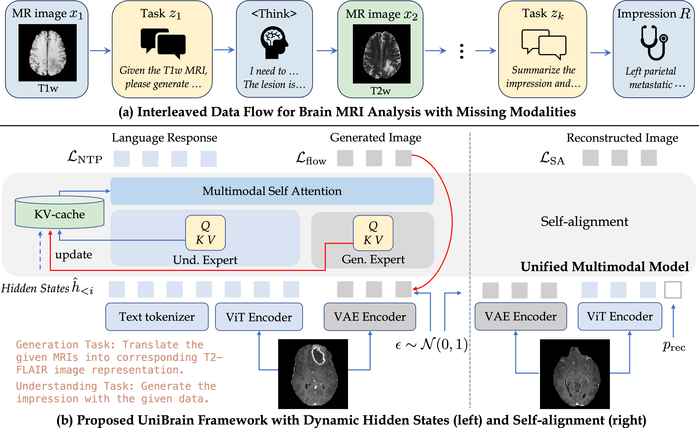

# UniBrain

Official implementation for our MICCAI 2026 paper **UniBrain**: Unified Multimodal Model for Brain MRI Imputation and Understanding

<p align="center">
  
</p>

**Abstract:**
Multimodal large language models (MLLMs) hold great potential for medicine, as they inherit knowledge from LLM and allow multiple data modalities to be integrated, analysed and interpreted in natural language. However, the field of medical MLLMs is constrained by non-trivial challenges, notably the scarcity of high-quality training data and the frequent occurrence of missing data in the real-world clinical setting. Here, we propose a novel unified multimodal model, UniBrain, for brain magnetic resonance image (MRI) analysis. To address potential missing brain MRI modalities, we employ a unified training strategy to perform joint imaging modality imputation and brain image understanding. During training, an interleaved and description-enriched data flow is constructed to train the model in an autoregressive manner, enabling medical reasoning with generated multimodal data. A self-alignment strategy is introduced to leverage dense image embeddings to learn fine-grained anatomical features without requiring detailed image captions. Furthermore, we propose a dynamic hidden state mechanism to alleviate the exposure bias during long-context multimodal inference. Extensive experiments on multi-disease brain MRI dataset demonstrate that UniBrain achieves high performance for brain image imputation, understanding, and disease diagnosis under various extents of modality incompleteness.

## Highlights
- **UMM for brain MRI:** unified multimodal model for brain MRI analysis that simultaneously handles missing sequence generation and disease diagnosis
- **Diagnosis with generated images:** pioneer exploration of interleaved data flow in the field of medical imaging.
- **Self alignment:** learning fine-grained anatomical representations with self-reconstruction.
- **Dynamic hidden states:** mitigating exposure bias during long-context multimodal reasoning by forcing the model to condition on its own generated artifacts during training.

## Installation

Create an environment and install the project dependencies:

```bash
cd code/UniBrain

conda create -n unibrain python=3.10 -y
conda activate unibrain

pip install torch==2.8.0 torchvision==0.23.0 torchaudio==2.8.0 --index-url https://download.pytorch.org/whl/cu128
pip install https://github.com/Dao-AILab/flash-attention/releases/download/v2.8.3/flash_attn-2.8.3+cu12torch2.8cxx11abiFALSE-cp310-cp310-linux_x86_64.whl
pip install -r requirements.txt
```

The code initializes UniBrain from the [BAGEL checkpoint](https://huggingface.co/ByteDance-Seed/BAGEL-7B-MoT). By default, scripts expect the base checkpoint under:

```text
models/BAGEL-7B-MoT
```

Download or place the BAGEL model files here before training or evaluation.

## Data

Training and evaluation use [RadGenome-Brain_MRI](https://huggingface.co/datasets/JiayuLei/RadGenome-Brain_MRI) dataset. To facilitate research, we provide all the preprocessed images and metadata [here](https://huggingface.co/datasets/Astrostellar/RadGenome-Brain_MRI_parquet).

Please also feel free to preprocess the data yourself. 
After downloading [RadGenome-Brain_MRI](https://huggingface.co/datasets/JiayuLei/RadGenome-Brain_MRI) and corresponding MRIs, we prepare the training data via:

```bash
python scripts/prepare_parquet_subjectwise.py
```

The scripts output expect the dataset metadata and split files at:

```text
../../data/RadGenome-Brain_MRI/all_parquet_Reg
../../data/RadGenome-Brain_MRI/dataset_info_Reg.json
../../data/RadGenome-Brain_MRI/train_val_test_split_subject.json
```

Noted that each subject should contain more than one modalities for our experiments. This have been pre-filtered in our split file.

## Training

Run the full three-stage training pipeline with:

```bash
bash scripts/train.sh
```

The default three-stage schedule is:

| Stage | Script | Data config | Initialization | Main purpose |
| --- | --- | --- | --- | --- |
| 1 | `scripts/train_s1.sh` | `RadGenome_SA.yaml` | `models/BAGEL-7B-MoT` | Medical reconstruction self-alignment |
| 2 | `scripts/train_s2.sh` | `RadGenome.yaml` | `results/checkpoints_s1/0002000` | Unified multimodal brain MRI modeling w/o self-forcing |
| 3 | `scripts/train_s3.sh` | `RadGenome.yaml` | `results/checkpoints_s2/0002000` | Self-forcing fine-tuning |

After training, use the final stage-3 checkpoint for evaluation. The examples below use:

```text
./results/checkpoints_s3/000200
```

If your local training script leaves the final stage-3 checkpoint under a different directory, replace `--model_path` with that checkpoint path.

## Evaluation

Use your own trained model or download our [checkpoints](https://huggingface.co/Astrostellar/UniBrain) and place them in the 'results' folder.
Feel free to download and use the last-stage (stage-3) checkpoint if you don't want to reproduce the ablation studies:
```bash
huggingface-cli download Astrostellar/UniBrain --include checkpoints_s3/ --local-dir ./results --local-dir-use-symlinks False
```

Run evaluation from the UniBrain repository root:

### 1. Modality Imputation

Use `--task generation` to evaluate MRI modality imputation. Provide one/multiple input modalities and one/multiple target modalities:

```bash
python evaluate_metrics.py \
  --model_path ./results/checkpoints_s3/000200 \
  --task generation \
  --modalities_in t1n \
  --modalities_out t2w
```

Example with multiple inputs:

```bash
python evaluate_metrics.py \
  --model_path ./results/checkpoints_s3/000200 \
  --task generation \
  --modalities_in t1n t2w \
  --modalities_out t2f
```

The script reports PSNR and SSIM and writes generated samples and metrics to:

```text
results/eval_samples/generation_<modalities_in>__<modalities_out>/
```

### 2. Brain Disease Diagnosis

Use `--task diagnosis` to evaluate diagnosis from the provided MRI modalities:

```bash
python evaluate_metrics.py \
  --model_path ./results/checkpoints_s3/000200 \
  --task diagnosis \
  --modalities_in t1n t2w t2f t1c
```

The diagnosis task reports correct count, total count, and accuracy.

### 3. Unified Generation and Understanding

Use `--task unified` to generate target modalities and then perform diagnosis in the same context, feel free to change the order/number of input/target modalities to evaluate the robustness:

```bash
python evaluate_metrics.py \
  --model_path ./results/checkpoints_s3/000200 \
  --task unified \
  --modalities_in t1n \
  --modalities_out t2w t2f t1c
```

The unified task reports:

- diagnosis accuracy
- generated samples and logs under `results/eval_samples/unified_<modalities_in>__<modalities_out>/`

### Evaluation Options

Common options in `evaluate_metrics.py`:

| Argument | Description | Default |
| --- | --- | --- |
| `--model_path` | Path to the UniBrain checkpoint | `models/BAGEL-7B-MoT` |
| `--task` | `generation`, `diagnosis`, or `unified` | `unified` |
| `--modalities_in` | Input MRI modalities | `t1n` |
| `--modalities_out` | Target MRI modalities | `t2w t2f t1c` |
| `--mode` | `2d` or `3d` evaluation (slice-wise inference) for generation tasks | `2d` |
| `--sample_time` | Number of generated samples to average for generation tasks | `1` |
| `--replaced_by` | Optional path to replacement generated images for diagnosis | `None` |

## Notes

- Evaluation currently assumes CUDA and uses a single GPU device with over 32 GB memory by default.
- If a fine-tuned checkpoint does not contain tokenizer/config/VAE files, `evaluate_metrics.py` links the missing files from `models/BAGEL-7B-MoT`.
- Update paths in the scripts if your BAGEL checkpoint, RadGenome data, or output directory is stored elsewhere.

## Acknowledgement

This repository is adapted from [BAGEL](https://github.com/ByteDance-Seed/Bagel), a unified multimodal foundation model for natural images. We thank the BAGEL authors for releasing their code and model.
<!-- 
## Citation

If you use UniBrain in your research, please cite our MICCAI paper:

```bibtex
@inproceedings{unibrain2026,
  title     = {Unified Multimodal Model for Brain MRI Imputation and Understanding},
  author    = {Zhiyun Song, Che Liu, Tian Xia, Avinash Kori, Wenjia Bai},
  booktitle = {Medical Image Computing and Computer Assisted Intervention (MICCAI)},
  year      = {2026}
}
```

Please replace the placeholder citation with the final MICCAI proceedings entry when available. -->

## License

This project builds on [BAGEL](https://github.com/ByteDance-Seed/Bagel) and [AutoRG-Brain](https://github.com/ljy19970415/AutoRG-Brain). Please follow the licenses of this repository and any datasets or pretrained checkpoints used with UniBrain.
